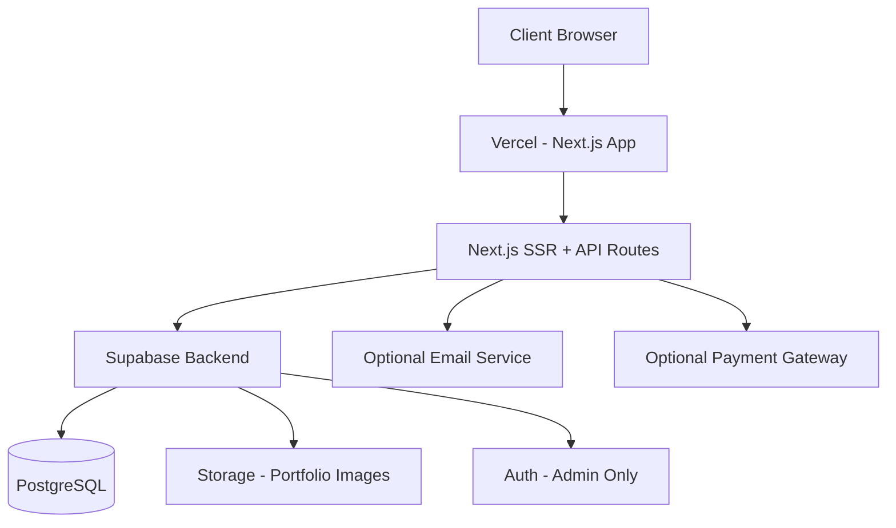
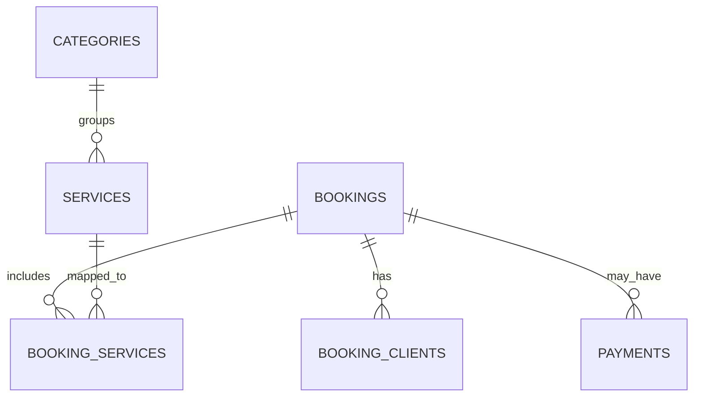

# Technical Design Document (TDD)

**Project:** Makeup Artist Web Application
**Tech Stack:** Next.js (SSR), Supabase (PostgreSQL + Storage + Auth), Vercel (Deployment)

---

# 1. Introduction

## 1.1 Purpose

This document defines the detailed technical architecture, system design, database structure, API design, deployment strategy, and operational considerations for the Makeup Artist Web Application.

It serves as a blueprint for development, testing, deployment, and maintenance.

---

## 1.2 System Overview

The application will:

- Showcase the artist’s portfolio
- Display services and pricing
- Allow customers to contact and request quotes
- Support booking for:
  - Multiple services
  - Multiple clients
  - Different services per client

- Be SEO-optimized via SSR
- Run fully on free tiers (Vercel + Supabase)

---

# 2. System Architecture

## 2.1 High-Level Architecture



---

## 2.2 Architectural Decisions

| Component    | Decision                   | Reason                                |
| ------------ | -------------------------- | ------------------------------------- |
| Frontend     | Next.js with SSR           | SEO + performance                     |
| Hosting      | Vercel Free Tier           | Cost-effective, optimized for Next.js |
| Database     | Supabase PostgreSQL        | Managed DB + free tier                |
| File Storage | Supabase Storage           | Centralized image handling            |
| Auth         | Supabase Auth (Admin only) | Lightweight admin control             |
| API          | Next.js API Routes         | Avoid separate backend server         |

---

# 3. Functional Design

---

## 3.1 Public Pages

### 1. Home Page

- Hero section
- Featured portfolio items
- Highlight services
- CTA buttons

### 2. About Page

- Biography
- Certifications
- Experience

### 3. Services Page

- List services
- Show pricing
- Add to booking cart
- Filter by category

### 4. Booking Page

- Multi-service selection
- Multiple clients per booking
- Service assignment per client
- Date & time selection
- Booking summary
- Submission

### 5. Contact Page

- Message form
- Quote request checkbox
- Special requirements field

---

## 3.2 Admin Dashboard (Protected)

All admin pages require Supabase Auth login. The admin section lives under `/admin/*`.

### 1. Admin Login Page (`/admin/login`)

- Email/password login via Supabase Auth
- Redirect to dashboard on success
- Error handling for invalid credentials

### 2. Admin Dashboard Home (`/admin`)

- Overview metrics: total bookings (by status), recent inquiries, active services count
- Quick links to management sections

### 3. Services Management (`/admin/services`)

- Table listing all services (active and inactive)
- Add new service form (name, description, price, duration, category)
- Edit existing service (inline or modal)
- Deactivate/reactivate service (soft delete)
- Manage categories (add/edit)

### 4. Bookings Management (`/admin/bookings`)

- Table of all bookings with filtering (by status: pending/confirmed/cancelled, by date range)
- Booking detail view showing:
  - Customer info
  - All clients and their assigned services
  - Total price breakdown
- Actions: confirm or cancel booking
- Status update workflow

### 5. Portfolio Management (`/admin/portfolio`)

- Grid/table of all portfolio items
- Upload new portfolio images (via Supabase Storage)
- Edit title, description, category
- Toggle featured status
- Delete portfolio items

### 6. Contact Requests (`/admin/contacts`)

- Table of all contact requests and quote inquiries
- Filter: all / quote requests only
- View full message details
- Mark as read/responded

---

# 4. Database Design

## 4.1 Entity Overview



---

## 4.2 Tables

### categories

- id (UUID, PK)
- name
- created_at

---

### services

- id (UUID, PK)
- name
- description
- price
- duration_minutes
- category_id (FK)
- is_active
- created_at

---

### portfolio_items

- id (UUID)
- title
- description
- image_url
- category
- is_featured
- created_at

---

### bookings

- id
- customer_name
- email
- phone
- event_date
- event_time
- location
- special_instructions
- total_price
- status (pending/confirmed/cancelled)
- created_at

---

### booking_clients

- id
- booking_id (FK)
- client_name
- created_at

---

### booking_services

- id
- booking_id (FK)
- booking_client_id (FK)
- service_id (FK)
- service_price
- created_at

---

### contact_requests

- id
- name
- email
- phone
- message
- is_quote_request
- created_at

---

### payments (Optional)

- id
- booking_id (FK)
- amount
- payment_status
- payment_provider
- transaction_reference
- created_at

---

# 5. Booking Flow Design

## 5.1 Booking Logic

1. User selects services
2. Specifies number of clients
3. Assigns services to each client
4. Chooses event date & time
5. Submits booking
6. System:
   - Validates slot availability
   - Calculates total price
   - Saves booking
   - Returns confirmation

---

## 5.2 Slot Validation Strategy

MVP approach:

- Prevent double booking on same date/time.
- Query existing bookings:

  ```sql
  select count(*) from bookings
  where event_date = selected_date
  and event_time = selected_time
  and status != 'cancelled';
  ```

If count > threshold → reject.

Future:

- Time-block system using service duration.

---

# 6. API Design

## 6.1 Public Endpoints

| Method | Endpoint          | Purpose               |
| ------ | ----------------- | --------------------- |
| GET    | /api/services     | Fetch active services |
| GET    | /api/portfolio    | Fetch portfolio       |
| POST   | /api/contact      | Save contact request  |
| POST   | /api/booking      | Create booking        |
| GET    | /api/availability | Check slot            |

---

## 6.2 Admin Endpoints (Protected via Supabase Auth)

| Method | Endpoint                 | Purpose                    |
| ------ | ------------------------ | -------------------------- |
| POST   | /api/services            | Add service                |
| PUT    | /api/services/:id        | Update service             |
| DELETE | /api/services/:id        | Disable service            |
| GET    | /api/bookings            | View all bookings          |
| GET    | /api/bookings/:id        | View booking details       |
| PUT    | /api/bookings/:id/status | Update booking status      |
| GET    | /api/contacts            | View contact requests      |
| PUT    | /api/contacts/:id        | Mark contact as responded  |
| POST   | /api/portfolio           | Add portfolio item         |
| PUT    | /api/portfolio/:id       | Update portfolio item      |
| DELETE | /api/portfolio/:id       | Delete portfolio item      |
| POST   | /api/upload              | Upload image to storage    |
| GET    | /api/categories          | List categories            |
| POST   | /api/categories          | Add category               |
| PUT    | /api/categories/:id      | Update category            |
| GET    | /api/admin/stats         | Dashboard overview metrics |

---

# 7. Security Design

## 7.1 Row Level Security (RLS)

Enabled for:

- bookings
- contact_requests
- services (admin update only)
- portfolio_items (admin CRUD only, public read)

Policies:

- Public: Read access for services, portfolio, categories. Insert-only for bookings and contact requests.
- Admin (via service_role key): Full CRUD access on all tables. Admin API routes verify Supabase Auth token before processing.

---

## 7.2 Input Validation

- Zod schema validation (frontend + backend)
- Sanitization for message fields
- Email format validation
- Rate limiting (optional)

---

# 8. SEO Strategy

- SSR for services & portfolio
- Dynamic meta tags
- OpenGraph support
- Sitemap.xml generation
- Structured data (JSON-LD)

---

# 9. Deployment Design

## 9.1 Environment Variables

Stored in Vercel:

- NEXT_PUBLIC_SUPABASE_URL
- NEXT_PUBLIC_SUPABASE_ANON_KEY
- SUPABASE_SERVICE_ROLE_KEY (server only)

---

## 9.2 Deployment Pipeline

1. Push to GitHub
2. Vercel auto-deploy
3. Environment config
4. Production build
5. Domain mapping

---

# 10. Non-Functional Requirements

| Requirement           | Target         |
| --------------------- | -------------- |
| Page Load             | < 2.5 seconds  |
| Mobile Responsiveness | 100%           |
| Uptime                | Vercel SLA     |
| Security              | HTTPS enforced |
| SEO Score             | 90+ Lighthouse |

---

# 11. Scalability Considerations

Future upgrades supported:

- Payment integration
- Calendar sync
- Advanced availability engine
- Admin dashboard UI
- Analytics dashboard
- CRM-style client tracking
- Discount codes
- Blog module

---

# 12. Risks & Constraints

| Risk                 | Mitigation                    |
| -------------------- | ----------------------------- |
| Free tier limits     | Optimize queries, image sizes |
| No payment initially | Add later via modular design  |
| Booking conflicts    | Introduce slot-locking logic  |

---

# 13. Testing Strategy

## Unit Testing

- Booking logic
- Price calculation
- Slot validation

## Integration Testing

- API endpoints
- Database inserts

## Manual Testing

- Booking multi-client scenario
- Quote submission
- Edge cases

---

# 14. Acceptance Criteria

- Multi-client booking works
- Services manageable via admin dashboard
- Admin can manage portfolio (upload, edit, delete, toggle featured)
- Admin can view and manage all bookings (confirm/cancel)
- Admin can view all contact requests and quote inquiries
- Admin login is secure and only allows authorized users
- Contact form saves data
- SEO metadata renders correctly
- Production deployment successful
- RLS policies enforced

---

# 15. Future Enhancements Roadmap

Phase 2:

- Payment gateway
- Email automation
- Booking calendar UI
- Advanced analytics in admin dashboard

Phase 3:

- CRM dashboard
- Multi-artist support
- Advanced availability engine

---

# 16. Technical Addendum: Foundation Shade Finder

## 16.1 System Architecture

- **Processing**: Pure client-side via HTML5 Canvas `getImageData`. Runs algorithmically inside `src/utils/shade-detection.ts`.
- **Database Table**: `foundation_leads` stores `uuid`, `full_name`, `email`, `phone`, `image_url`, `undertone`, `depth`, `avg_rgb`, `recommended_shades`, `interested_in_makeup`, `selected_service`.
- **Storage**: `foundation-uploads` bucket configured with public read/insert RLS policies.
- **API**: `POST /api/shade-leads` uses Supabase Service Role and Zod input validation to insert leads securely.

## 16.2 Shade Detection Logic

- **Sampling Region**: X (30%-70%), Y (35%-65%), sampling every 5th pixel.
- **UnderTone Map**: Calculated via relative ratios. `(rRatio - bRatio) * 100`. > 15 (Warm), < 5 (Cool), else Neutral.
- **Depth Map**: Calculated via RGB to HSL lightness. >= 75 (Fair), >= 60 (Light), >= 45 (Medium), >= 30 (Tan), else Deep.
